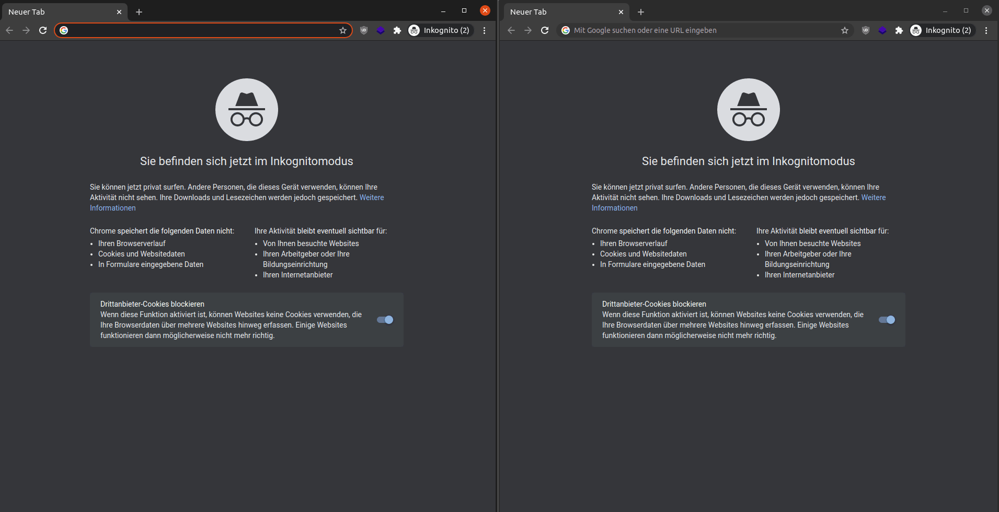

# Multiplayer Tic-Tac-Toe with Websockets

### Description
This project is a small implementation as example for the usage of websockets in php.

### Goal
- Create and start a websocket server on specific port
- Connect to the websocket via javascript
- Send data and handle response from websocket server
- Define multiple rooms in php to make possible multiple people can play against
- Implement game logic for tic-tac-toe in php
- Create a tiny frontend with tic-tac-toe typically look

## Result

## Development
Start the socket server with:
- Step 1:
``
php bin/socket-server.php
``
- Step 2: Open the `index.html` in your favorit browser

## Docker
Build the images and starts the containers:

`docker-compose up -d`

## Vagrant
If you don't have docker installed but vagrant is available just use it with:
`vagrant up`

It will install docker and docker-compose and run `docker-compose up -d` command afterwards.

Info: Not tested so far because i run docker on my machine and no vagrant ;)